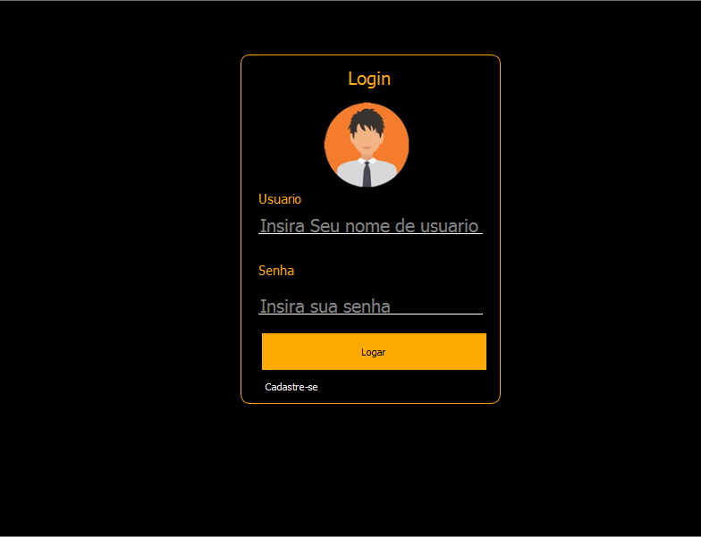

<h1 align="center ">Projeto introduçao a progamaçao <h1>
<h1 align = "center">
<h3>PAGINA INICIAL<H3>
  
</h1>

<h4 align="center"> 
	🚧  Back End   🚀 Em construção...  🚧
</h4>

<h2 style="color:blue">Features<h2>

- [x] Cadastro de usuário
- [x] Cadastro de cliente
- [x] Cadastro de produtos
- [x] Realizaçao de vendas
- [ ] Impresão de nota fiscal

<h2> Técnologias<h2>
<ul>
<li>Python
<li>Pyqt5
<li>Mysql
<ul>

